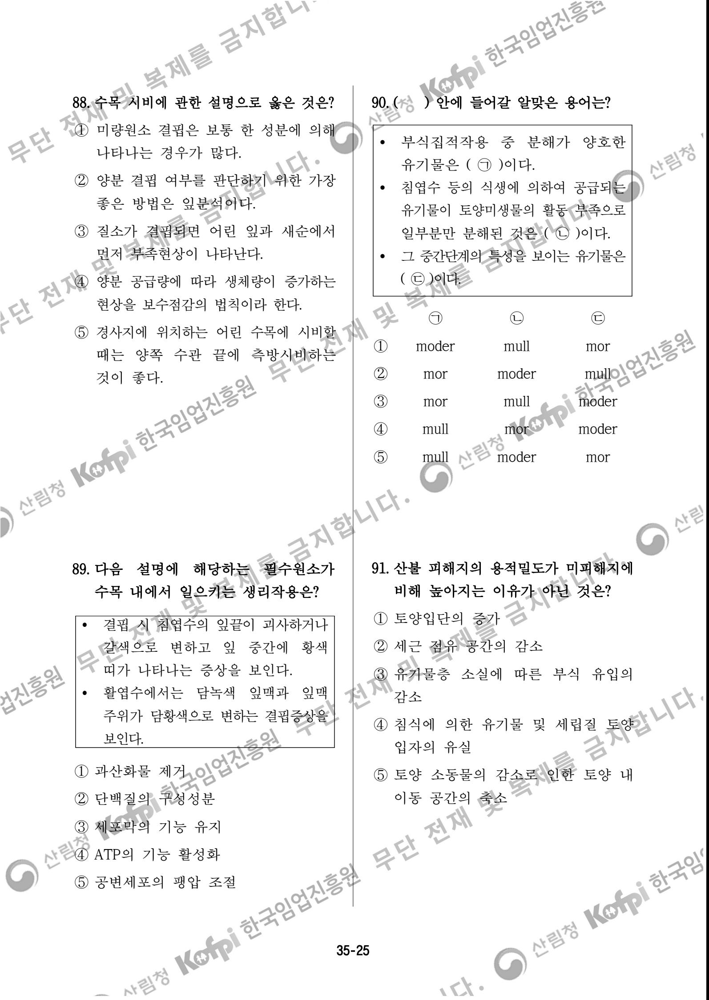

## 제 회 나무의사 자격시험 차 시험 문제지 11 1

## 【 】 수험자 유의사항

1. 시험 문제지 표지와 문제지의 총 면수 문제 번호 순서 인쇄 상태 , , 등을 확인해야 합니다.

2. 부정행위 방지를 위하여 답안지와 시험 문제지에 수험번호와 성명을 모두 기재해야 합니다.

- 3. 답은 각 문제마다 요구하는 가장 적합한 개만 1 , 선택해야 하며 답안지 작성 시 답안을 잘못 기재한 경우 책임은 전적으로 수험자에게 있습니다.
- 4. , 시험 중 대화를 하거나 물품을 빌릴 수 없으며 질문이 있거나 답안지 교체를 원할 때는 손을 들어야 합니다.
- 5. 시험이 종료되면 감독관 지시에 따라 답안지를 제출해야 합니다.

※ 감독관이 안내할 때까지 표지를 넘기지 마십시오. - . - 수험자 여러분의 합격을 기원합니다 

| 5.                | 수목 또는 산림 쇠락에 관한 일반적인                          | 7. 밤나무에 발생하는 줄기마름병         | 과 ( ) ㉠       |
|-------------------|-----------------------------------------------|-------------------------------|------------------|
|                   | 설명으로 옳지 않은 것은?                                | ) 가지마름병 ( ㉡          | 에 관한 설명으로 옳지     |
|                   | ① 도관을 갖고 있는 수종에서만 발생이                         | 않은 것은?                        |                  |
| 보고되고 있다.          |                                               | ㉡ ① ㉠ 균보다            | 균의 기주범위가 훨씬      |
|                   | ② 생물적 요인과 비생물적 요인에 의하여                        | 넓다.                           |                  |
|                   | 복합적으로 나타난다.                                   | 균과 ㉡ ② ㉠             | 균 모두 감염부위에 자낭    |
|                   | ③ 한두 그루에 국한하지 않고 성숙목                          | 각을 만든다.                       |                  |
|                   | 또는 성숙림에서 광범위하게 발생한다.                          | 균은 감염부위에 분생포자각을 만들 ③ ㉠  |                  |
| ④                 | 나무 생존에 대한 위협이라기보다는                            | 균은 분생포자반을 만든다 지만 , ㉡ |                  |
|                   | 자연 평형 유지 등 생태적 현상이라는                          | ㉡ ④ ㉠ 균과             | 균 모두 밤나무 가지와 줄기를 |
| 견해도 있다.           |                                               | 병원균 속 감염하지만 ,           | 은 다르다 (genus) |
| ⑤ 비생물적 요인 등    | 1 차 요인에 의해                                 | ㉡ ⑤ ㉠ 과              | 의 발생을 줄이기 위해서는   |
|                   | 시작되어 생물적 요인 등 차 요인에 2 의해 피해가 심해진다       | 밤나무의 비배와 배수 관리에 유의            |                  |
|                   |                                               | 하여야 한다.                       |                  |
|                   |                                               |                               |                  |
|                   |                                               |                               |                  |
|                   |                                               |                               |                  |
| 6.                | 다음 버섯과 관련된 설명으로 옳지                            | 8. 병든 가지를 접수로 사용하였을 때      |                  |
| 않은 것은?            |                                               | 접목부를 통하여 전염되는 병이 아닌           |                  |
| (                 | ㉠ 말 발 굽잔나비버섯 )                             | 것은?                           |                  |
|                   | (Fomitopsis officinalis)                   | ① 벚나무 번개무늬병                   |                  |
| ㉡ 말똥진흙버섯          |                                               | ② 오동나무 빗자루병                   |                  |
|                   | (Phellinus igniarius)                      | ③ 쥐똥나무 빗자루병                   |                  |
| 과㉠ 은 모두 ① ㉡ | 목재부후균이다.                                      | ④ 포플러류 갈색무늬병                  |                  |
| 은㉠ 주로 침엽수를 ②   | , 은㉡ 주로 활엽수를                            | ⑤ 포플러류 모자이크병                  |                  |
| 감염한다.             |                                               |                               |                  |
| ③ ㉡의              | 피해가 심해지면 목질부가                           |                               |                  |
|                   | 스펀지처럼 쉽게 부서진다.                                |                               |                  |
|                   | ④ ㉠의 피해를 심하게 받은 목질부는                          |                               |                  |
| 네모 모양으로 금이        | 가면서 쪼개진다                                      |                               |                  |
| ⑤ ㉠            | 은 리그닌을 완전히 분해하지만 , ㉡은 리그닌을 거의 분해하지 못한다. |                               |                  |
|                   |                                               |                               |                  |
|                   |                                               |                               |                  |
|                   | 35-2                                          |                               |                  |

| 17. 수목병원체가 기주에 침입하는 방법에                       | 19. 병원성 곰팡이의 특징으로 옳은 것은?                                   |  |
|--------------------------------------------------|------------------------------------------------------------|--|
| 관한 설명으로 옳지 않은 것은?                                | ① 상처를 통해 침입할 수 없다.                                         |  |
| ① 바이러스는 선충에 의해 침입할 수                          | ② 균핵과 후벽포자는 휴면을 위해 형성                                      |  |
| 있다.                                              | 된다.                                                        |  |
| ② 곰팡이와 세균은 자연개구로 침입할                          | ③ 담자균류는 영양생장기관의 단순공 격벽                                     |  |
| 수 있다.                                            | 근처에 꺽쇄연결이 존재한다.                                            |  |
| ③ 파이토플라스마는 매개충에 의해 침입                            | ④ 유성생식을 통해 자낭균은 분생포자를,                                     |  |
| 할 수 있다.                                          | 담자균은 녹포자를 형성한다.                                            |  |
| ④ 곰팡이는 수목 세포 내부로 직접 침입                           | ⑤ 분생포자는 주로 , 1 차 전염원이 되고                          |  |
| 할 수 있다.                                          | 월동한 자낭과에서 형성된 자낭포자는                                        |  |
| ⑤ 세균은 부착기와 흡기로 수목에 직접                            | 2 차 전염원이 된다                                             |  |
| 침입할 수 있다.                                        |                                                            |  |
|                                                  |                                                            |  |
|                                                  |                                                            |  |
|                                                  |                                                            |  |
|                                                  |                                                            |  |
| 18. 다음 특징을 지닌 병원체가 일으키는 수목병에 관한 설명으로 옳지 않은    | > 에서 같은 종류의 자낭과를 20. < 보기 형성하는 수목병만을 고른 것은? |  |
| 것은?                                              | >                                                          |  |
|                                                  | < 보기 섬잣나무 잎떨림병 ㄱ                                  |  |
| 분류학적으로 몰리큐트강에 속한다.  세포는 원형질막으로만 둘러싸여  | ㄴ. 밤나무 줄기마름병                                               |  |
| 있다.                                              | 물푸레나무 흰가루병 ㄷ                                            |  |
| 전신감염성이다  사부조직에 존재하고 ,                  | ㄹ. 곰솔 리지나뿌리썩음병                                          |  |
| ① 매미충에 의해 주로 전반된다.                               | 단풍나무 타르점무늬병 ㅁ                                           |  |
| ② 항생제 엽면살포와 토양관주는 방제                          | 잣나무 송진가지마름병 ㅂ                                           |  |
| 효과를 보기 어렵다.                                      | ① ㄱ ㄷ ㄹ , ,                                          |  |
| ③ 형광염색소를 이용한 형광현미경기법                          | ② ㄱ ㄷ ㅂ , ,                                          |  |
| 으로 진단할 수 있다.                                     | ③ ㄱ ㄹ ㅁ , ,                                          |  |
| ④ 매개충은 병원체를 최초 획득한 후                          | ④ ㄴ ㄹ ㅁ , ,                                          |  |
| 기주수목에 바로 전반시킬 수 있다.                              | ⑤ ㄴ ㅁ ㅂ , ,                                          |  |
| ⑤ 병원체는 매개충 체내에 존재하며                           |                                                            |  |
| 매개충 탈피 과정에서도 살아남는다.                              |                                                            |  |
|                                                  |                                                            |  |
|                                                  | 35-5                                                       |  |
|                                                  |                                                            |  |

| 21. 적절한 풀베기로 병 발생 또는 피해               | 23. Cercospora속 또는 Pseudocercospora속이 |
|------------------------------------------|------------------------------------------------|
| 확산을 감소시킬 수 있는 수목병만을                      | 일으키는 수목병에 관한 설명으로                           |
| 나열한 것은?                                  | 옳지 않은 것은?                                      |
| ① 소나무 혹병 향나무 녹병 ,                  | 소나무 ① 잎마름병은 주로 묘목에                 |
| ② 곰솔 잎녹병 전나무 잎녹병 ,                 | 발생한다.                                          |
| ③ 전나무 빗자루병 전나무 잎녹병 ,               | ② 때죽나무점무늬병균은 월동한 후                    |
| ④ 잣나무 털녹병 오리나무 잎녹병 ,               | 분생포자가 1 차 전염원이 된다                        |
| 회화나무 녹병 ⑤ 모과나무 붉은별무늬병 ,         | ③ 느티나무흰무늬병균은 병반 안쪽에 분생포자경 및 분생포자가 밀생한다.  |
|                                          | ④ 벚나무갈색무늬구멍병균은 흑색 돌기                        |
|                                          | 형태의 분생포자퇴나 자낭각을 형성한다.                          |
|                                          | ⑤ 무궁화 점무늬병이 심하게 발생하면                        |
|                                          | 기주의 수세는 약해지나 개화에는 영향이 없다.                   |
|                                          |                                                |
|                                          |                                                |
|                                          |                                                |
|                                          |                                                |
|                                          |                                                |
| 22. 뿌리혹선충에 관한 설명으로 옳지                    | 의 24. 소나무류 병명과 병원체 속 (genus)          |
| 않은 것은?                                   | 연결이 옳지 않은 것은?                                  |
| 구침을 가지고 있으며 알로 증식한다. ①                | ① 혹병 – Cronartium                           |
| 기 유충이 뿌리에 침입하여 정착한다 ② 2            | ② 가지마름병 – Fusarium                          |
| ③ 감염한 기주식물에 거대세포 형성을                  | ③ 피목가지마름병 – Diplodia                        |
| 유도한다.                                    | ④ 가지끝마름병 – Sphaeropsis                      |
| 아까시나무 오동나무 등 주로 ④ 밤나무 , , | ⑤ 재선충병 – Bursaphelenchus                    |
| 활엽수 묘목을 가해한다.                            |                                                |
| 차 탈피를 마치고 성충이 되면 암 수의 ⑤ 4       |                                                |
| 형태가 유사해진다.                               |                                                |
|                                          |                                                |
|                                          |                                                |
|                                          |                                                |
| 35-6                                     |                                                |

| 34. 곤충의 호르몬에 관한 설명으로 옳지              | 36. 곤충의 방어행동 관련 용어에 대한              |
|-----------------------------------------|----------------------------------------|
| 않은 것은?                                  | 설명으로 옳지 않은 것은 ?                     |
| 유약호르몬은 알라타체에서 분비된다. ①                | ① 의사는 적의 공격을 받았을 때 갑자기              |
| 앞가슴샘자극호르몬은 카디아카체에서 ②                 | 죽은 체하는 행동이다.                           |
| 합성된다.                                   | ② 위장은 주변과 유사하게 색깔을 바꾸어              |
| ③ 번데기로 용화할 때는 유약호르몬의                 | 구별하기 어렵게 하는 행동이다.                      |
| 농도가 낮아진다.                               | ③ 경고는 냄새 소리 눈에 띄는 몸 색깔 , , |
| ④ 탈피호르몬은 앞가슴샘에서 합성되어                 | 등으로 상대에게 위협을 가하는 행동                    |
| 혈림프로 분비된다.                              | 이다.                                    |
| 은 ⑤ 허물벗기호르몬 (eclosion hormone) | ④ 은폐는 잎에 앉아 있는 곤충이 사람이              |
| 뇌의 신경분비세포에서 합성된다.                       | 다가가면 잎의 뒷면으로 숨는 행동을 포함한다.           |
|                                         | ⑤ 베이트형 모방은 독을 가지고 있는                |
|                                         | 곤충들끼리 유사한 패턴을 유지하여                  |
|                                         | 공격을 피하는 전략적 행동이다.                      |
|                                         |                                        |
|                                         |                                        |
|                                         |                                        |
|                                         |                                        |
| 35. 수목해충의 산란행동에 관한 설명으로              | 37. 수목해충의 월동생태에 관한 설명으로             |
| 옳지 않은 것은?                               | 옳지 않은 것은?                              |
| ① 개나리잎벌은 잎의 조직 속에 1~2 줄로       | 호두나무잎벌레는 성충으로 월동한다. ①               |
|                                         |                                        |
| 산란한다.                                   | ② 거북밀깍지벌레는 교미 후 암컷성충만               |
| ② 복숭아유리나방은 수피 틈에 개씩 1             | 월동한다.                                  |
| 산란한다.                                   | ③ 점박이응애는 수정한 암컷성충으로                 |
| ③ 박쥐나방은 날아다니면서 알을 지면에                | 수피나 낙엽 등에서 월동한다.                       |
| 떨어뜨린다.                                  | 벚나무모시나방은 노숙유충으로 지피물 ④               |
| ④ 솔껍질깍지벌레는 가지에 알주머니                  | 이나 낙엽 밑에서 집단으로 월동한다.                   |
| 형태로 낳는다.                                | 솔알락명나방은 노숙유충으로 흙 속 ⑤                |
| 극동등에잎벌은 잎 가장자리 조직 ⑤ 속에 덩어리로 산란한다. | 에서 월동하거나 알이나 어린유충으로 구과에서 월동한다.      |
|                                         |                                        |
|                                         |                                        |
| 35-10                                   |                                        |

| 38. 감로와 분비물로 인해 발생되는                 | 40. 'A' 수목해충의 발육영점온도를                             |
|-----------------------------------------------|---------------------------------------------------------|
| 관련이 없는 해충류는 그을음병과 ?                     | 로 다음 표의 주일간 10℃ 가정할 때 , 1                |
| ① 잎응애류                                        | 일평균기온에 따른 유효적산온도                                  |
| ② 나무이류                                        | 는 DD) ? (degree day,                                 |
| ③ 매미충류                                        | 월 일 / 11 12 13 14 15 16 17 3 |
| ④ 가루이류                                        | 평균기온 8 10 12 15 18 20                    |
| ⑤ 깍지벌레류                                       | 7 ) ( ℃                                        |
|                                               | ① 20                                                    |
|                                               | ② 25                                                    |
|                                               | ③ 30                                                    |
|                                               | ④ 45                                                    |
|                                               | ⑤ 90                                                    |
|                                               |                                                         |
|                                               |                                                         |
|                                               |                                                         |
|                                               |                                                         |
| 39. 솔수염하늘소의 방제 방법으로 옳지                     | 」 농약안전정보시스템 에 「 41. 농촌진흥청                   |
| 않은 것은?                                        | 등록된 약제의 해충 방제 시기 및 방법에                                  |
| ① 성충 우화시기에 드론ㆍ지상방제를                        | 관한 설명으로 옳은 것은?                                          |
| 실시한다.                                         | ① 매미나방은 유충발생초기인 월에 7                           |
| 30 ② 목재 중심부 온도를 56.6 ℃ 에서 분 | 경엽처리를 한다.                                               |
| 이상 열처리한다.                                     | ② 솔잎혹파리는 유충발생초기인 월에 4                             |
| ③ 중대경목 벌채산물은 1.5 cm 이하의                 | 수관처리를 한다.                                               |
| 두께로 제재하여 활용한다.                                | ③ 밤나무혹벌은 성충발생최성기인 월에 7                               |
| ④ 성충이 우화하기 전에 티아메톡삼                        | 수관처리를 한다.                                               |
| 분산성액제로 나무주사를 한다.                              | ④ 오리나무잎벌레는 유충발생초기인 월에 4                              |
| ⑤ 목질부에 있는 유충의 방제는 월에 7                  | 경엽처리를 한다.                                               |
| 파쇄 그물망 고사목을 벌채하여 훈증 , ,           | 잣나무별납작잎벌 잣나무넓적잎벌 은 ) ⑤ (                       |
| 피복 등을 실시한다.                                   | 유충발생초기인 4~5 월에 경엽처리를 한다                           |
|                                               |                                                         |
|                                               |                                                         |
|                                               |                                                         |
| 35-11                                         |                                                         |

42. 해충 발생밀도 조사방법과 대상해충의 연결이 옳은 것은? ① 먹이트랩 솔껍질깍지벌레 - ② 성페로몬트랩 솔잎혹파리 - ③ 유아등트랩 - 복숭아명나방 ④ 털어잡기 - 소나무좀 ⑤ 황색수반트랩 버즘나무방패벌레 -

## 44. 진딧물류 중 기주전환을 하지 않는 종만을 나열한 것은?

- ① 곰솔왕진딧물 붉은테두리진딧물 ,
- ② 물푸레면충 소나무왕진딧물 ,
- ③ 소나무왕진딧물 조록나무혹진딧물 ,
- ④ 외줄면충 호리왕진딧물 ,
- ⑤ 조팝나무진딧물 진사진딧물 ,

45. 천적의 기주 및 방사시기에 관한 설명으로 옳지 않은 것은?

① 칠레이리응애는 점박이응애의 알과 성충을 포식한다.

② 진디혹파리 유충은 목화진딧물의 약충과 성충을 포식한다.

- ③ 콜레마니진디벌은 복숭아혹진딧물의 약충과 성충 몸속에 산란한다.
- ④ 혹파리살이먹좀벌은 솔잎혹파리 유충이 지면에 낙하하는 월에 방사한다 11 .
- ⑤ 중국긴꼬리좀벌은 밤나무혹벌의 기생성 천적으로 월 하순 월 상순에 방사 4 ~5 한다.

43. 수목해충의 친환경 방제 방법에 관한 설명으로 옳지 않은 것은? ① 사사키잎혹진딧물은 성충이 탈출하기 전에

혹이 생긴 잎을 채취하여 매몰한다. ② 소나무좀은 신성충의 그해 산란 피해를 막기 위해 끈끈이롤트랩을 줄기에 감싼다. ③ 솔껍질깍지벌레는 성페로몬을 이용한 끈끈이트랩으로 수컷을 대량 유살한다. ④ 주둥무늬차색풍뎅이는 월동성충이 알을 낳기 전에 유아등을 이용하여 포획한다. ⑤ 큰이십팔점박이무당벌레는 잎 뒷면에 산란한 알덩어리를 채취하여 소각한다.

35-12

| 67. (     |               |                     | ) 안에 들어갈 용어로 적합한                         | 69.   | 보기 > <        | 에서                            |   | 강한 빛에 의해 광합성 |  |
|--------------|---------------|---------------------|------------------------------------------|-------|---------------------|-------------------------------|---|--------------|--|
| 것은?          |               |                     |                                          |       |                     | 기구가 손상되는 것을 막기 위한             |   |              |  |
|              |               |                     |                                          |       |                     | 수목의 반응으로 옳은 것을 모두             |   |              |  |
|              |               | 종자 활력 간이검사법의 하나인    | 테트라 졸륨 시험 시, 세포의 호흡에서 중추적             |       | 고른 것은?              |                               |   |              |  |
| 역할을 하는       | (             | ) ㉠                 | 효소는 테트라                                  |       |                     | < 보기                       | > |              |  |
| 졸륨 용액과 결합하면  |               | ( ㉡              | ) 이 되어                                |       |                     | ㄱ. 카로테노이드는 들뜬                 |   | 에너지를         |  |
| ( ㉢       | ) 색을 띠게 된다 |                     |                                          |       |                     | 흡수하여 열로 방출한다.                 |   |              |  |
|              |               |                     |                                          | ㄴ     | 잔토필                 | (xanthophyll)                 |   | 회로에 따라       |  |
|              | ㉠             | ㉡                   | ㉢                                        |       |                     | 제아크산틴을 합성한다.                  |   |              |  |
| ①            | 탈수소           | 포르말린                | 검은                                       |       |                     | ㄷ. 광계 사이에 에너지 분배를 조절하여        |   |              |  |
| ②            | 탈수소           | 포르마잔                | 붉은                                       |       |                     | 광저해 현상을 억제한다.                 |   |              |  |
| ③            | 탈산소           | 포르말린                | 노란                                       | ㄹ.    |                     | 엽록체는 입사광에 평행한 측벽으로            |   |              |  |
| ④            | 탈산소           | 포르마잔                | 붉은                                       |       |                     | 이동하여 빛 흡수를 최소화한다.             |   |              |  |
| ⑤            | 탈산소           | 포르말린                | 검은                                       |       | ① ㄱ ㄴ,              |                               |   |              |  |
|              |               |                     |                                          |       | ② ㄷ ㄹ,              |                               |   |              |  |
|              |               |                     |                                          |       | ③ ㄱ, ㄴ ㄷ,        |                               |   |              |  |
|              |               |                     |                                          |       | ④ ㄴ, ㄷ ㄹ,        |                               |   |              |  |
|              |               |                     |                                          |       | ⑤ ㄱ ㄴ ㄷ ㄹ , , | ,                             |   |              |  |
|              |               |                     |                                          |       |                     |                               |   |              |  |
|              |               |                     |                                          |       |                     |                               |   |              |  |
| 68.          |               |                     | 수목의 증산에 관한 설명으로 옳지                       |       |                     | 70. 수목의 호흡작용으로 옳지 않은 것은?      |   |              |  |
| 않은 것은?       |               |                     |                                          |       |                     | ① 오존(O3)에 노출되었을 때 잎의 호흡이      |   |              |  |
|              |               | ① 증산작용은 잎의 온도를 낮춘다. |                                          |       | 증가한다.               |                               |   |              |  |
|              |               |                     |                                          |       |                     |                               |   |              |  |
| ② 촉진한다.   |               |                     | 증산작용은 무기염의 흡수와 이동을                       | ②     | 증가한다.               | 수피를 벗겨 상처를 만들면 호흡이            |   |              |  |
|              |               |                     | ③ 낙엽수는 한겨울에는 증산작용을 하지                    |       |                     |                               |   |              |  |
| 않는다.         |               |                     |                                          | ③     | 음엽보다 낮다.            | 광도가 높을 때 양엽의 호흡량은             |   |              |  |
|              |               |                     |                                          |       |                     |                               |   |              |  |
| ④ 잎의 표면에 각피를 |               | 털을 많이 만들어 증산을 억제한다. | 두껍게 만들거나                                 | ④     |                     | 답압과 침수는 산소의 공급을 방해하여          |   |              |  |
|              |               |                     |                                          |       |                     | 뿌리호흡의 감소를 유발한다.               |   |              |  |
| ⑤            |               |                     | 소나무류는 잎의 표피 안쪽 깊숙한 곳에 기공이 위치하여 증산을 억제 |       |                     | ⑤ 잎은 완전히 자란 대비 호흡량이 가장 많다. |   | 직후에 중량       |  |
| 한다.          |               |                     |                                          |       |                     |                               |   |              |  |
|              |               |                     |                                          |       |                     |                               |   |              |  |
|              |               |                     |                                          |       |                     |                               |   |              |  |
|              |               |                     |                                          | 35-19 |                     |                               |   |              |  |
|              |               |                     |                                          |       |                     |                               |   |              |  |

| 71. 수목의 광합성 명반응에 관한 설명으로                | 73. 수목의 균근에 관한 설명으로 옳은                  |
|--------------------------------------------|-----------------------------------------|
| 옳지 않은 것은?                                  | 것은?                                     |
| ① 엽록소가 있는 그라나에서 이뤄지며                    | ① 내생균근균은 주로 담자균, 자낭균에                   |
| 산소가 발생한다.                                  | 속한다.                                    |
| ② 빛에너지를 ATP NADPH 와 에 저장 하는 | 균근균의 기주범위는 내생균근이 ②             |
| 과정으로 물의 분해가 일어난다.                          | 외생균근보다 훨씬 넓다.                           |
| ③ H+이 루멘에 축적되어 틸라코이드막을                     | ③ 외생균근균은 균투를 형성하지 않아                 |
| 경계로 H+ 농도의 차이가 발생한다                     | 뿌리털이 정상적으로 발생한다.                        |
| 합성효소에 의해 H+이 스트로마에서 ④ ATP         | ④ 내생균근은 온대지방에서는 소나무과,                   |
| 루멘으로 들어오면서 ATP 가 생성된다                | 자작나무과 등에서 흔히 참나무과 ,               |
| ⑤ 물이 분해되면서 방출된 전자는             | 발견된다.                                   |
| 에서 광계 Ⅰ 로 전달되어 NADP +를 광계 Ⅱ | ⑤ 외생균근균의 균사는 뿌리의 피층보다                |
| 환원시키는 데 기여한다.                              | 더 안쪽으로 침입하여 하르티히 망을                     |
|                                            | 만든다.                                    |
|                                            |                                         |
|                                            |                                         |
|                                            |                                         |
| 72. 무기영양소에 관한 설명으로 옳은                      | 안에 들어갈 용어로 알맞은 것은 74. ( ) ? |
| 것은?                                        | 수목의 질산환원은 뿌리로 흡수된                       |
| ① 식물체 내에서 효소의 보조인자인                     | 형태의 질소가 아미노산 합성에 ( ㉠ )            |
| Mg, Si 는 다량원소이다                         | ) 이용되기 전에 ( ㉡ 형태의 질소로       |
| ② 미량원소는 식물조직 내에 건중량의           | 산성 토양에서 자라는 환원되는 과정이다                |
| 0.1% 이하로 함유되어 있는 것을 말한다                 | 소나무류, 진달래류 등은 질산환원이                     |
| 은 체내에서 이동이 용이하지 않으며 , ③ Fe        | ) , 그렇지 않은 ( ㉢ 에서 일어나지만  |
| 기공의 삼투압을 가감하여 개폐시키는                        | 식물은 ) 에서 일어난다 ( ㉣           |
| 작용을 한다.                                    | ㉡ ㉢ ㉣ ㉠                        |
| ④ 이동성이 빠른 원소인 P, Mg 등은                     | NH4 줄기 + - ① NO3 뿌리   |
| 결핍증이 세포분열이 일어나는 곳인 어린 잎에서 먼저 나타난다.   | NO3 뿌리 - + ② NH4 잎    |
| ⑤ 무기영양소를 식물체 내에서 재분배하기                     | NH4 잎 + - ③ NO3 줄기    |
| 위해 이동시킬 때 사부를 이용하지                         | NH4 뿌리 + - ④ NO3 잎    |
| 않고 목부를 통해 이동시킨다.                           | NO3 잎 - + ⑤ NH4 뿌리    |
|                                            |                                         |
|                                            |                                         |
| 35-20                                      |                                         |
|                                            |                                         |

| 80. 도시공원 내 산성토양 개량용 석회                         | 82. 토양용액에 존재하는 다음 이온 중              |
|---------------------------------------------------|----------------------------------------|
| 물질의 시용에 관한 설명으로 옳지 않은                          | 일반적으로 농도가 가장 낮은 것은?                    |
| 것은?                                               | K+ ①                                |
| 석회요구량은 필요한 석회량을 Ca(OH)2로 ① 계산하여 나타낸 값이다.    | Ca2+ ②                              |
| 개량에 사용되는 석회물질은 토양 교질의 ②                        | Mg2+ ③                              |
| Al 과 직접 반응한다                                   | SO4 2- ④                         |
| 유기물 함량이 높은 토양은 낮은 토양 ③                         | H2PO4 - ⑤                        |
| 보다 석회요구량이 더 많다.                                   |                                        |
| ④ 동일한 양의 석회를 시용할 때는 입자가                        |                                        |
| 고운 석회물질의 반응이 더 빠르다.                               |                                        |
| ⑤ 점토 함량이 높은 토양은 모래 함량이 높은 토양보다 석회요구량이 더 많다. |                                        |
|                                                   |                                        |
|                                                   |                                        |
|                                                   |                                        |
|                                                   |                                        |
| 81. 토양의 점토광물에 관한 설명으로                             | 83. 토양침식성인자(soil erodibility factor)   |
| 옳지 않은 것은?                                         | 관한 설명으로 옳지 않은 것은 K 에 ?        |
| , 운모 등이 ① 2:1 형 점토광물로 장석              | 값의 범위는 ① K 0~0.1 이다        |
| 있다.                                               | 값이 ② K 0.04 보다 큰 토양은 쉽게 침식 |
| 비규산염 차 광물로 AlOOH, FeOOH 등 ② 2         | 된다.                                    |
| 이 있다 .                                            | ③ 토양이 가진 본래의 침식가능성을                 |
| 비팽창형 점토광물로 kaolinite, chlorite ③ 등이 있다.     | 나타내는 것이다. ④ K 값은 풍력의 단위침식능력에 의한  |
| ④ 기본 Si 와 O 로 이루어진 규산염광물의          | 유실량을 나타낸다.                             |
| 구조는 규소사면체이다.                                      | ⑤ 토양 구조의 안정성은 K 값에 영향을        |
| 비결정형 점토광물인 화산 ⑤ allophane 은           | 끼치는 중요한 특성이다.                          |
| 지대 토양의 주요 구성 물질이지만 일반 토양의 점토에도 존재한다.           |                                        |
|                                                   |                                        |
|                                                   |                                        |
|                                                   |                                        |
| 35-23                                             |                                        |

| 84. 토양미생물에 관한 설명으로 옳지                                           |                                                               |
|-----------------------------------------------------------------|---------------------------------------------------------------|
| 않은 것은?                                                          | 86. 토양의 수분퍼텐셜에 관한 다음 설명에서 안에 들어갈 알맞은 용어는 ( ) ? |
| ① Frankia속은 오리나무와 공생한다.                                      |  비가 오거나 관수 후 대공극에 채워                                      |
| 는 광합성을 할 수 있는 ② 조류 (algae)                             | 진 과잉 수분을 제거하는 데 ( ㉠ )                                   |
| 엽록소를 가지고 있다.                                                    | 퍼텐셜이 작용한다.                                                    |
| ③ Achromobacter속을 식물에 접종하면                                   |  토양 표면에 흡착되는 부착력과 토양                                      |
| 질소 고정력이 증가한다.                                                   | 입자 사이의 모세관에 의하여 만들 어지는 힘 때문에 ( ㉡ ) 퍼텐셜이        |
| ④ Azotobacter속, Clostridium속 등은 단생 독립 질소고정균이다 )  | 생성된다.                                                         |
| (                                                               |  주로 수면 이하에서 상부의 물 무게에                                     |
| ⑤ Nitrosomonas속, Nitrobacter속 등은 질소화합물을 산화하여 에너지를 얻는다. | 의해 ( ㉢ ) 퍼텐셜이 생성된다                                |
|                                                                 | 토양 용액 중에 존재하는 이온이나                                        |
|                                                                 | 농도 용질의 차이로 ( ㉣ ) 퍼텐셜이 발생한다.              |
|                                                                 |                                                               |
|                                                                 | ㉡ ㉢ ㉣ ㉠                                              |
|                                                                 | 매트릭 중력 삼투 압력 ①                                    |
|                                                                 | 매트릭 중력 압력 삼투 ②                                    |
|                                                                 | 삼투 매트릭 중력 압력 ③                                    |
|                                                                 | 중력 매트릭 압력 삼투 ④ 중력 삼투 압력 매트릭           |
|                                                                 | ⑤                                                             |
|                                                                 |                                                               |
|                                                                 |                                                               |
| 85. 석회암 등을 모재로 하여 생성된 토양 으로 Ca 과 Mg 함량이 높은 산림 | 87. 매립지의 알칼리성 토양을 개량하는 데 적합한 토양개량제는?                       |
| 토양군은?                                                           | ① 탄산칼슘(CaCO3)                                                 |
| ① 갈색산림토양군                                                    | ② 황산칼슘(CaSO4)                                                 |
| 암적색산림토양군 ②                                                   | ③ 수산화칼슘[Ca(OH)2]                                              |
| ③ 적황색산림토양군                                                   | ④ 탄산마그네슘(MgCO3)                                               |
| 화산회산림토양군 ④                                                   | ⑤ 탄산칼슘마그네슘[CaMg(CO3)2]                                        |
| 회갈색산림토양군 ⑤                                                   |                                                               |
|                                                                 |                                                               |
|                                                                 |                                                               |
| 35-24                                                           |                                                               |
|                                                                 |                                                               |

| 수목관리학                                  | 103.매립지 식재에 관한 설명으로 옳지                 |
|----------------------------------------|----------------------------------------|
|                                        | 않은 것은?                                 |
| 101.식재지 환경과 그에 적합한 수종의                 | 폐기물매립지에는 키가 작고 천근성이며 ①              |
| 연결이 옳지 않은 것은?                          | 내습성이 있는 수종을 식재한다.                      |
| 토양이 척박한 지역 – ① 보리수나무 ,     | 해안매립지에는 감탕나무 ② 곰솔 , ,   |
| 곰솔                                     | 녹나무 등을 식재한다 아까시나무 ,              |
| 배수가 잘 안되는 지역 – ② 왕버들 ,     | 폐기물매립지 식재지반에는 가스수집정 ③               |
| 낙우송                                    | 우물 과 ) ( 가스배출용 배기파이프를      |
| 토양이 건조한 지역 – ③ 호랑가시나무 ,    | 설치한다.                                  |
| 눈향나무                                   | 가 (EC) ④ 해안매립지에서는 전기전도도          |
| 고층건물에 가려진 그늘 지역 – ④ 느티나무 , | 0.7 dS/m 이하인 물을 관수하여                   |
| 개잎갈나무                                  | 토양 내 염분을 제거한다.                         |
| ⑤ 염분을 함유한 바람이 많은 해안 지역              | 해안매립지 식재지반에는 점토질 토양을 ⑤              |
| 향나무 – 때죽나무 ,                  | 갯벌 바닥에 40 cm 이상의 두께로             |
|                                        | 포설하여 염분차단층을 설치한다.                      |
|                                        |                                        |
|                                        |                                        |
| 102.도시의 수목 생육 환경에 관한 설명으로              | 104. 전정에 관한 설명으로 옳지 않은 것은?             |
| 옳지 않은 것은?                              | ① 죽은 가지는 지륭을 손상시키지 않고               |
| ① 대도시는 건물에 의한 대기의 흐름 변화             | 바짝 자른다.                                |
| 등으로 미기후의 변화가 크다.                       | 개의 동일세력줄기가 발생한 낙엽 ② 3            |
| ② 대도시의 야간 상시조명이 주변 수목의              | 활엽교목은 그중 1 개를 억제한다               |
| 생식생장에 영향을 줄 수 있다.                      | 이듬해 꽃을 감상하고자 하는 백목련, ③              |
| ③ 대기오염이 심한 도심환경의 경우                 | 치자나무는 당년에 꽃이 지자마자 등 ,            |
| 식재할 수 있는 가로수의 수종 선택이                   | 전정한다.                                  |
| 제한될 수 있다.                              | 수목의 형태를 유지하기 ④ 토피어리 (topiary) |
| ④ 도시의 토양은 주기적인 낙엽 제거로               | 위해서는 생육기간 중에 2 회 이상              |
| 산림토양에 비해 용적밀도는 낮고,                     | 전정한다.                                  |
| 투수계수는 높다.                              | ⑤ 송전선 주변의 수목은 필요한 만큼만               |
| ⑤ 남부지방 수종을 중부지방 도심에                 | 가지가 전선을 피해 자랄 전정하고 ,             |
| 식재하면 극단적 기상 발생 시 큰 피해를 입을 수 있다.     | 수 있도록 유도한다.                            |
|                                        |                                        |
|                                        |                                        |
|                                        | 35-29                                  |
|                                        |                                        |

| 108. 수목의 동해에 관한 설명으로 옳은                                         | 수목의 볕뎀 볕데기 ) 피해 및 관리에 110. ( |
|-----------------------------------------------------------------|------------------------------------------|
| 것은?                                                             | 설명으로 옳은 것은 관한 ?                    |
| 자작나무 오리나무는 동해를 ① 사시나무 , ,                        | 어두운 색깔의 수피를 가진 나무는 ①                  |
| 자주 받는다.                                                         | 피해가 적다.                                  |
| ② 생육기간 중에 낮은 기온으로 나타나는                                       | ② 햇볕에 노출된 토양의 온도가 상승하면                |
| 저온 피해를 의미한다.                                                    | 피해가 심해진다. 햇볕에 노출된 줄기를 검은색 끈끈이         |
| ③ 고위도 생육 수종은 저위도 생육 수종보다 내한성이 약하다.                        | ③ 롤트랩으로 감싼다.                          |
| 피해를 받은 낙엽 활엽수의 어린 ④                                          | ④ 줄기의 상단부에서 피해가 심하여                   |
| 가지를 이른 봄에 제거한다.                                                 | 이 부분을 마대로 감싼다.                           |
| ⑤ 봄에 개화하고 열매가 다음 해에 익는                                       | ⑤ 장마 후 고온 건조하면 묵은 잎보다                 |
| 수종은 열매가 월동 중에 피해를 받을                                            | 새잎에서 탈수 현상이 심하다.                         |
| 수 있다.                                                           |                                          |
|                                                                 |                                          |
|                                                                 |                                          |
|                                                                 |                                          |
|                                                                 |                                          |
| 109. 수목의 침수 후 나타나는 변화에 관한                                       | 111. 복토 또는 심식 피해에 관한 설명으로             |
| 설명으로 옳은 것은?                                                     | 옳지 않은 것은?                                |
| 줄기의 신장이 촉진된다. ①                                              | 활엽수는 잎이 작아지고 황화된다. ①                  |
| 뿌리에서 다량의 옥신이 생성된다. ②                                         | 수목의 지제부에 ② 병목현상이 있고 뿌리가 썩는다.    |
| 잎이 안으로 말리고 오래 붙어있다. ③                                        | 굵은 뿌리의 노출된 부분이 거의 없고, ③               |
| 주목은 잎 아랫면에 과습돌기 ④ (edema, 물혹 가 형성된다 수종 , ) | 잎이 일찍 떨어진다.                              |
| 층층나무는 침수 후 과습 ⑤ 벚나무 ,                                  | ④ 활엽수에서는 수관의 아래에서 위로                  |
| 토양에서 큰 피해가 없다.                                                  | 가지 고사가 진행된다.                             |
|                                                                 | 침엽수 수관 전체의 잎이 퇴색하여 ⑤                  |
|                                                                 | 마르면 수세를 회복하기 힘들다.                        |
|                                                                 |                                          |
|                                                                 |                                          |
|                                                                 |                                          |
| 35-31                                                           |                                          |
|                                                                 |                                          |

| 120. 약제 저항성 발달을 억제하기 위한        | 122. 농약 안전사용기준을 설정하는 데                       |
|-----------------------------------|-------------------------------------------------|
| 방안이 아닌 것은?                        | 고려하는 내용이 아닌 것은?                                 |
| 동일 품목 약제를 반복 사용한다. ①           | 사용 횟수 ①                                      |
| 경종적 방법이나 기계적 방법을 병행 ②          | 적용대상 농작물 ②                                   |
| 하여 방제한다.                          | 어독성과 방제효과 ③                                  |
| ③ 병해충의 발달 상황을 고려하여 농약          | 사용제형과 사용시기 ④                                 |
| 살포적기를 준수한다.                       | 약제의 잔류허용기준 ⑤                                 |
| ④ 경제적 피해허용수준을 준수하여       |                                                 |
| 농약의 불필요한 사용을 억제한다.                |                                                 |
| 약제의 권장사용량 미만 사용이 양적 ⑤          |                                                 |
| 저항성을 유발하므로 권장사용량을           |                                                 |
| 준수한다.                             |                                                 |
|                                   |                                                 |
|                                   |                                                 |
|                                   |                                                 |
| 121. 버즘나무방패벌레를 8% 클로티아니딘 | 」 소나무재선충병 방제 지침 소나무 「 123.          |
| 배 입상수용제로 방제하려 한다 . 2,000    | 재선충병 집단발생지에 관한 설명으로                             |
| 희석 살포액을 100 L 조제하여 수관             | 옳지 않은 것은?                                       |
| 살포할 때 , 필요한 약량과 적절한 사용법을    | 개 표준지 크기는 0.04ha(20m×20m) ① 1          |
| 옳게 연결한 것은?                        | 이다.                                             |
| 입제살포법 ① 50 g -              | 개 표준지 내 소나무류 비율이 25% ② 1               |
| 분무법 ② 50 g -                | 이상이다.                                           |
| 50 mL - 관주법 ③               | 20% ③ 1 개 표준지 내 소나무류 중 이상           |
| 연무법 ④ 20 mL -               | 고사한 경우이다.                                       |
| 미스트법 ⑤ 20 g -               | 피해가 집단으로 발생한 경북 경주ㆍ안동 ④                      |
|                                   | ㆍ고령ㆍ성주ㆍ대구 달성 등 7 개 지역을 특별방제구역으로 지정하였다. |
|                                   | ⑤ 피해고사목과 기타고사목이 집단적으로                        |
|                                   | 25개 이상 발생한 표준지가 1 년 동안                 |
|                                   | 예찰ㆍ조사된 읍ㆍ면ㆍ동을 말한다.                              |
|                                   |                                                 |
|                                   |                                                 |
|                                   |                                                 |
| 35-34                             |                                                 |
|                                   |                                                 |

| 」 「 124. 2025년도 산림병해충 예찰ㆍ방제계획 | 」 산림보호법 시행령 제 조 에 따른 7 「 125. 12 |
|----------------------------------------|-------------------------------------------------------|
| 소나무재선충병 확산 저지를 위한                      | '나무의사 등의 자격취소 및 행정                                    |
| 기본방향 및 세부추진 계획에 관한                     | 에 관한 설명 중 처분의 세부기준 '                            |
| 설명 중 옳지 않은 것은?                         | 옳지 않은 것은?                                             |
| 피해지역 추가 확산을 막기 위한 전략 ①              | 나무의사 등의 자격증을 빌려준 경우 ①                              |
| 방제 추진력을 확보한다                           | 2 1 차 위반 시 자격정지 년에 처한다                       |
| 매개충 혼생 권역 충남ㆍ경북 은 월부터 ) 9 ② ( | ② 위반행위가 둘 이상일 경우 각각의                               |
| 이듬해 4 월까지 방제한다                   | 처분기준이 다를 때 그 중 무거운 처분                                 |
| 북방수염하늘소 권역경기ㆍ강원ㆍ충북은 ) ③ (     | 기준을 따른다.                                              |
| 4 9 월부터 이듬해 월까지 방제한다             | ③ 거짓이나 부정한 방법으로 나무의사                               |
| 반복ㆍ집단적 피해 발생지에 ④ 대규모 ,        | 등의 자격을 취득한 경우 차 위반 시 1                             |
| 대한 수종전환 방제 적극 도입한다.                    | 자격이 취소된다.                                             |
| 솔수염하늘소 권역 전북ㆍ전남ㆍ경남 ⑤ (           | 둘 이상의 처분기준이 같은 자격정지인 ④                             |
| ㆍ제주 은 9 5 ) 월부터 이듬해 월까지 | 경우에 각 처분 기준일을 합산한 기간                                  |
| 방제한다.                                  | 동안을 자격 정지하되 5 년을 초과할                            |
|                                        | 수 없다.                                                 |
|                                        | ⑤ 위반행위의 횟수에 따른 행정처분                                |
|                                        | 기준은 최근 3 년 동안 같은 위반 행정처분을 받은 경우에 적용          |
|                                        | 행위로 받는다.                                           |
|                                        |                                                       |
|                                        |                                                       |
|                                        |                                                       |
|                                        |                                                       |
|                                        |                                                       |
|                                        |                                                       |
|                                        |                                                       |
|                                        |                                                       |
|                                        |                                                       |
|                                        |                                                       |
|                                        |                                                       |
|                                        |                                                       |
|                                        |                                                       |
|                                        |                                                       |
|                                        |                                                       |
| 35-35                                  |                                                       |

